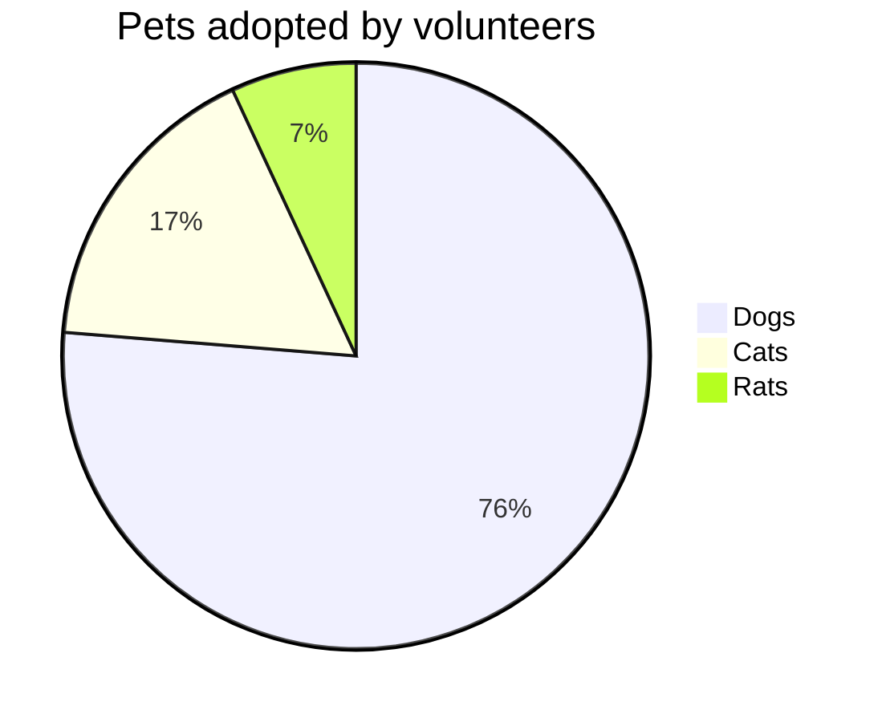

> 种一棵树，最好的时间是十年前，其次是现在。

好记性不如烂笔头，知识飞速迭代的互联网时代，需要时刻做好学习的准备，
或者不断巩固已经掌握的知识。曾经在博客上花了很多功夫，但都是捣鼓一些表面上的东西，
动效啦样式等等花里胡哨的，也不断的探寻过哪款写作笔记软件更加好用...

渐渐地，也终于意识到了内容才是需要首要关注的东西，没有内容一切都是空架子。
同时，内容也应相对独立，方便哪天天心血来潮想给博客站点重新装修，
这也是我最终选择MarkDown写作而非富文本编辑的重要原因。

## MarkDown
> Markdown是一种轻量级标记语言，创始人为约翰·格鲁伯。
> 它允许人们使用易读易写的纯文本格式编写文档，然后转换成有效的XHTML（或者HTML）文档。
> 这种语言吸收了很多在电子邮件中已有的纯文本标记的特性。 --维基百科

除了基本的语法外，本博客配置了jekyll的MarkDown引擎[kramdown](https://kramdown.gettalong.org/)
有一些拓展功能

### 基本语法

正文内容需要多敲一个空行才能进行分段，
比如这段话在之前在markdown中是有个换行的，但实际渲染出来并没有换行。

而这一段话之前有一个空行，渲染出来是另一个段落

- 无序列表
- 无序列表
  - 缩进
- 无序列表

1. 有序列表
2. 有序列表
   1. 子列表
   2. 子列表
3. 有序列表

* 也可以
* 用星号来表示
* 无序列表

- [x] check项目
- [ ] check项目

```
代码块
```

这是一段 `行内代码`

> 引用

1至6个`#`表示H1-H6

[方括号加圆括号链接](http://www.markitdown.net/)

尖括号直接包住地址变成链接<http://www.markitdown.net/>

当前页面的锚点:[基本语法](#基本语法)


三个中短线`---`表示分割线

---

数学公式

$ a * b = c ^ b $

$ 2^{\frac{n-1}{3}} $

$ \int\_a^b f(x)\,dx. $

表格

| \:Fruits         ||  Food   :|
|:-------- |:------ |:-------- |
| Apple    | Banana |  Orange  |
| Apple    | Banana |  Orange  |

图表，使用[mermaid](https://mermaid-js.github.io/mermaid/#/)



UML，使用[plantuml](https://plantuml.com/zh/)

``` plantuml!
Bob -> Alice : hello world
```

## 写作

### 分类与标签

写作是对表和归纳总结能力的锻炼，同时有助于维护自己的知识框架体积。
通常博客系统都会通过归档、分类和标签三个维度来管理文章。归档是从时间维度，
而分类和标签，相信大多数人对这两者的区别都会比较含糊，首先最直观的一点是，
一篇文章只能属于一个分类。

但问题又来了，如何定义一个分类或者标签呢，比如"前端"，如果将其作为一个标签，
那"vue"呢？这两个似乎是不同层级，如果作为分类，那"打包构建"又该作为分类还是标签？...

这些说白了就是怎么构建知识体系的问题，根据知乎上的一些讨论，分类应该是严谨且确定的，
具有排他性，相互独立，需要事先规划，而标签则是描述内容特性的附加内容。
规划分类的这个过程其实就是在建立博客的知识体系。

我是一名前端工程师，同时爱好广泛，我希望我的博客不止记录一些技术文章，
鉴于此，设计如下的分类：
1. JavaScript：关注js本身核心
2. CSS：深入css细节
3. 大前端：前端框架、浏览器等
4. 计算机网络：http、websocket等
5. 数据结构与算法
6. 设计模式
7. 运维部署
8. 技术相关
9. 独立游戏
10. 工作总结
11. 随笔杂谈
12. 音乐
13. 绘画
14. ...


标签太宽泛容易导致于分类产生歧义，且不利于检索维护标签，所以需要有一定的颗粒度，
例如：
1. webpack
2. vue3
3. react
4. ...

### 书写规范

1. 中英文符号不能混用
2. 中文穿插英文时，前后需要空格
3. 专有英文名词使用大驼峰
4. 标签英文统一使用小写
5. 分类英文统一使用大写
6. 文件名中英文混合使用短横线
7. 文件名不可包含额外的标点符号
8. 文章标题英文使用大驼峰
9. ...
